# ai-startup-website
This is my first repository as a DevOps Engineer
# Mini-Project Basic Git Command

## Hands-on Git Project: Collaborative Website Development with Git and GitHub

In this project we will create a step by step simulaion of workflow between Tom and Jerry using Git and GitHub. This indludes installation of Git, creating a repository, clonning the repository,creating branches, switching between branches, making changes and merging the changes into the main branch.

### Definition of terms
1. Git: A version control system that tracks changes in your codebase and allows collaboration among multiple developers.
2. GitHub: A cloud-based platform that hosts Git repositories, making it easy to collaborate, review, and manage code online.
3. Repository: A folder (local or on GitHub) where your project’s files and version history are stored.
4. Cloning: Making a full local copy of a remote GitHub repository to your computer using **git clone**.
5. Branch: A lightweight version of your codebase that allows you to work on features or fixes independently **(e.g., main, update-navigation, add-contact-info)**.
6. Branching: The act of creating a new branch from an existing one using **git branch** or **git checkout -b**.
7. Merging: Combining changes from one branch, typically with git merge.
8. Status: Shows the current state of your working directory and staging area with **git status**.
9. Stagging: Preparing changes for commit using **git add**. It’s like putting files into a “ready to commit” box.
10. Commit: Saving a snapshot of your staged changes to the repo history using **git commit -m "message"**.
11. Push: Sending your local commits to a remote repository like GitHub using **git push**.
12. Pull: Fetching and merging changes from a remote repository into your local branch with **git pull**.
 

**Part 1: Initial SetUp and Configuration** 

1. **Install Git:** 

- Visit the [Official Git Website](https://git-scm.com/) and [Download](https://git-scm.com/downloads) the version of Git for your operating sysyem. Follow the installation instructions.

2. **Create a GitHub Repository:** 

- Signup or login to [GitHub](https://github.com/).  

- Click the "New" in the top-right corner and select "New Repository" 

 

- Name your repository (e.g., "mini-project, ai-startup-website") and initialize it with a README file. 

- Click "Create repository" 

3. **Clone the repository:** 

- On your repository's page on GitHub, click the "Code" button and copy the HTTPS URL. 

 

- Open your terminal or command prompt 

- Create a folder named **git-project** in the folder where you are storing all **DAREY.IO** related work. For example in the Desktop folder on your laptop, you may create a folder called **"darey training"**.

- Change directory into the **"git-project"**  

- Clone (Download) the repositoryfrom GitHub using    

 

- Since you just clonned your repository, your branch is "main". 

- Navigate into the repository that is clonned.  

- Create an empty file **"index.html"** 

 

- Add content to the empty file.

 

 

- Check changes has not been staged. 

 

- Stage changes to the empty index.html 

Now, after stagging the changes, the file name will appear in **green** in the terminal output. This colour change signifies that the file has been successfully stages, making it ready for the next step, which is committing these changes to the project's history.

 

-  Commit changes have been staged for the commit. 

 

- This takes the staged changes and records them in the repository's history with a message describing what was done. The commit is a milestone, making a specific point in the project's development. 

- Push main branch to GitHub.

 

This send commits from the main branch on your laptop to GitHub (Remote Repository). 

**Part 2: Simulating Tom and Jerry's Work**: 

To simulate both Tom and Jerry working on the same laptop, you will switch between two branches making changes as each characters. 

1. Tom's Work: 

- Navigate to the project directory you just cloned. 

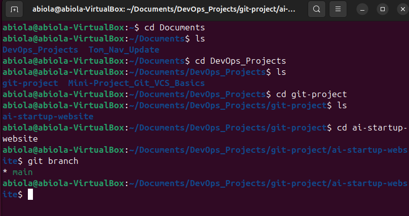 

This moves you into the folder containing the cloned GitHub repository on your local machine. It is like steppinng into the project's workspace. 

- Check the current branch: This shows you a list of all branches in your local repository. Initially, you will see only the "**main**" branch because that's the default starting point and no other branches have been created yet. 

- Create a new branch for Tom's work: 

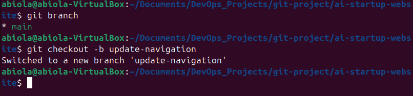 
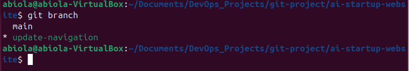 

This creates a new branch named **"update-navigation"** (You can name it whatever you wan). The command also automatically switches to the newly created branch from the **"main"** branch. This branch **"update-navigation"** is where Tom's updates to the website without affecting whatever is in the **"main"** branch. 

- Recall you created an empty file "index.html" in the main and content was added. The  file will also exist in the 'update-navigation-branch': Open the 'index.html' and add the content below. 

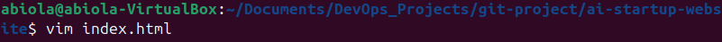

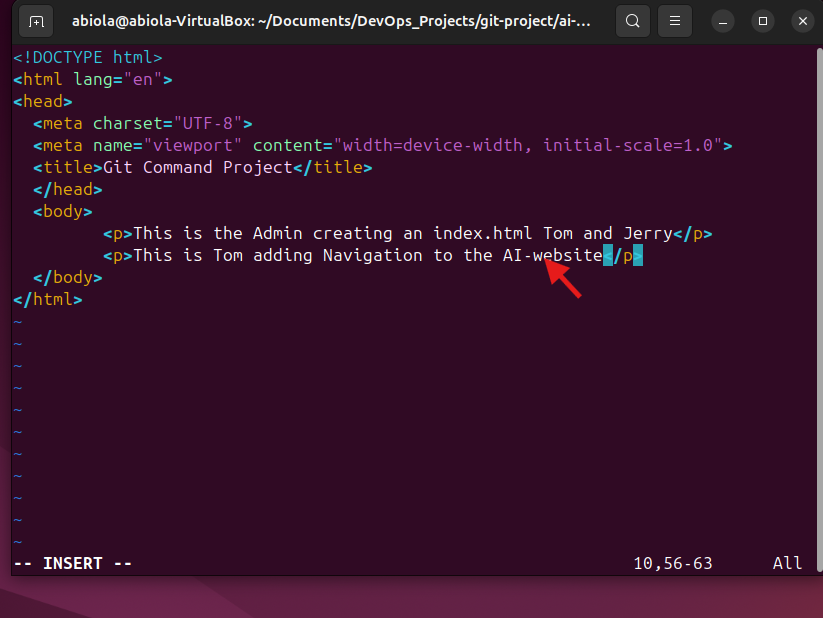 

This simulates Tom's contribution to the project. This text represents the work he's doing on the navigation bar. In the real world, this will be an actual software code. 

- Check changes has not been staged. 

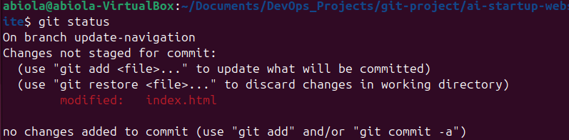 

At this stage, Tom has modified the file, but these changes have not not been prepared for a commit in Git. This is indicated by the file name appearing in **red** in the terminal output, signaling that the changes are recognised by Git but not yet staged. 

- Staged Tom's changes: git add index.html can be used to stage only index.html file, to staged all the changes in the project for Tom's git add . will be ok.

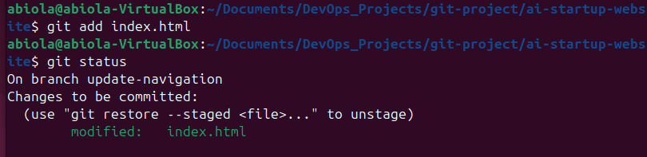 

This tells Git that you want to include the updates made to **index.html** in the next commit. It is like saying, "Okay, I'm happy with these changes and ready to record them". 

- Confirm changes have been staged for commit: 

 

Now, after staging the changes, the file name will change or appear in **green** in the terminal output. This colour changes signifies that the file has been successfully staged, making it ready for the next step, which is committing these changes to the project's history. 

- Commit Tom's changes 

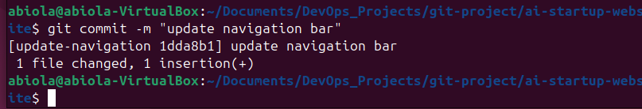 

This takes the staged changes and records them in the repository's history with a message describing what was done. This commit is a milestone, making a specific point in the project's development. 

- Push Tom's branch to GitHub: 

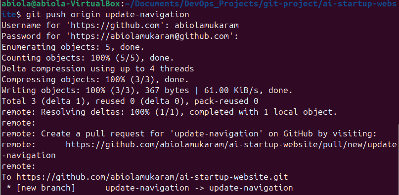 

This send Tom's commits from your local branch on your laptop to GitHub (Remote Repository). It's like publishing your work so that others (or in this case "Jerry") can see and interact with it. This step updates the remote repo with Tom's contributions. 

After complete Tom's workflow you will now simulateJerry's contribution to the project. Todo this you will 

- switch back to main branch, 

- create a new branch for Jerry, 

- make changes, and then 

- Stage, commit, and push this to GitHub. 

1. Jerry's Work: 

- Switch Back to the Main Branch:

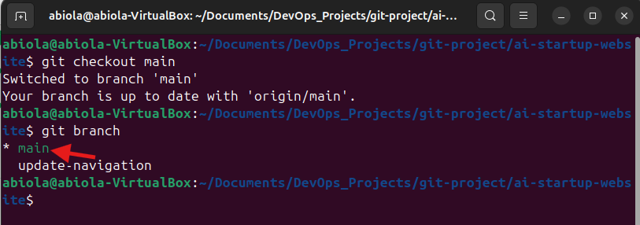 

This command switches your current working directory back to the main branch, ensuring that Jerry's changes start from the latest version of the project. 

- Pull the latest changes: 

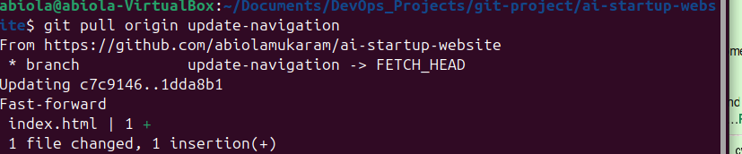 

This ensures that you have the latest changes updates from the
repository, including Tom's merged changes, if any.

- Create a New branch for Jerry's work: 

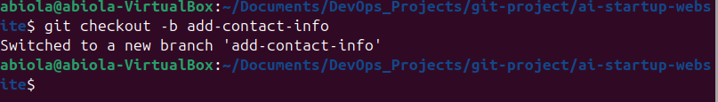 

This creates a new branch where Jerry will make his changes, keeping them separate from the **main** project until they are ready to be merged. 

-Open **index.html** file by adding contact information. This simulates Jerry's task. 

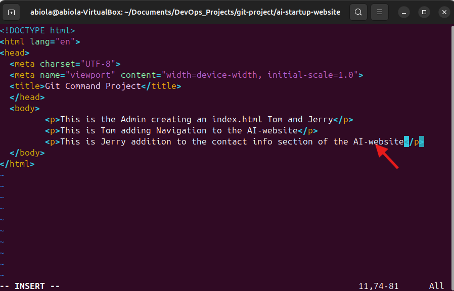 

- Stage Jerry's Work

This commands stages the changes Jerry made to the **index.html** and everything in the project file, preparing them for commit. 

- Commit Jerry's Changes: 

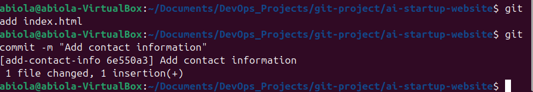

This saves Jerry's changes in the branch's history, with a message describing what was done. 

- Push Jerry's Branch to GitHub: 

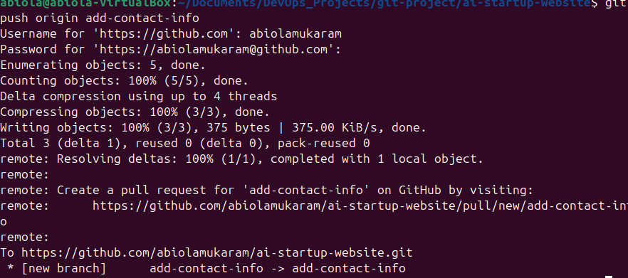 

All the commands use above uploads Jerrys branch to the GitHub repository, making it available for review and merging into the main project.

